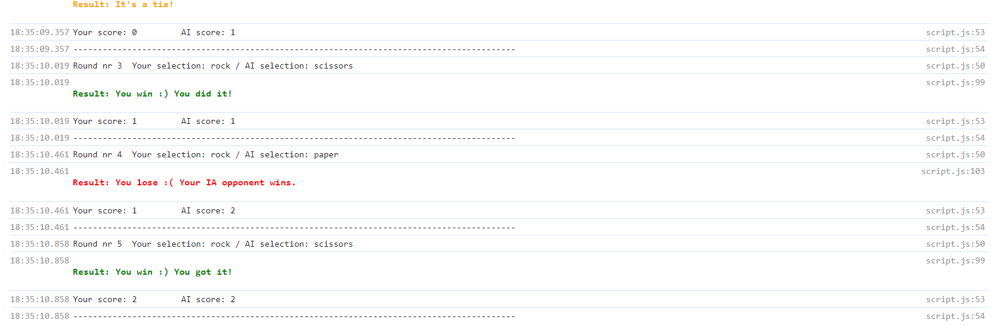
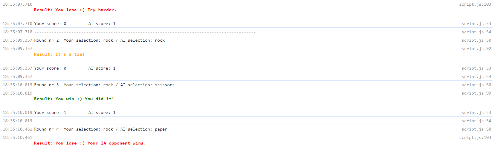
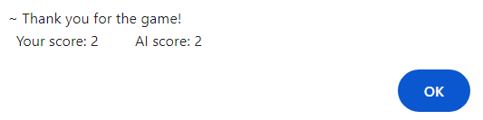

### KreativStorm-project2
## ✂️ Our Rock, Paper, Scissors Game-   


## Table of contents

  - [Overview](#overview)
  - [The Project](#the-project)
  - [Screenshots](#screenshots)
  - [Links](#links)
  - [What we used](#What-we-used)
  - [What we learned](#what-we-learned)
  - [Code snippets](#Code-snippets)
  - [Continued development](#continued-development)
  - [Useful resources](#useful-resources)


## Overview

### The Project
We created a rock, paper, scissors Js game that can be played on the console of our browser.

### Links

- Solution URL: [Github](https://github.com/elic4vet/kreativstorm-project2-game)
- Live Site URL: [Live demo](https://github.com/elic4vet/kreativstorm-project2-game)

### Screenshots









### What we used

- Different types of console methods, like: console.log() and console(clear);
- Window Object Methods: prompt(), alert(), confirm();
- Primitives and Reverence Types (strings, numbers, boolean, null, arrays, functions);
- Variables (let, const);
- Loops (for…. / do … while ….);
- Conditional Statements (if … else …);
- JS Operators ( arithmetic operators – increment; comparison operators – equality operator; ternary / conditional operator; logical operators)
- The %c format specifier to style the console messages with CSS.

### What we learned

- How to create a game using  JavaScript.
- How to style the console messages with CSS, using the %c format specifier.

### Code snippets

Some code snippets of our project:

```js
const gameInstruction = `
%c///////////////////////////////////////////////////////////////////////////

Willing to try your luck and win over your AI opponent … ? Let\'s begin!

Here are the rules:
- "scissors" cuts "paper"
- "paper" wraps "rock"
- "rock" breaks "scissors"

Each round, you will be asked to choose and enter JUST one among these 3 words:
scissors / paper / rock

- There are 5 rounds.
- After each round a result is displayed.
- A player with a higher, final score wins.

Warning!
If you make a mistake while playing, the round repeats itself.

Good luck!

///////////////////////////////////////////////////////////////////////////
`;
 
```
```js
function game() {
  for (let i = 0; i < 5; i++) {
    const computerSelection = computerPlay();
    const playerSelection = obtainPlayerSelection();
    console.log(`Round nr ${i+1}  Your selection: ${playerSelection} / AI selection: ${computerSelection}`);
    const result = playRound(playerSelection, computerSelection);
    updateScores(result);
    console.log(`Your score: ${playerScore}         AI score: ${computerScore}`);
    console.log("------------------------------------------------------------------------------------------");
  }
  alert(`~ Thank you for the game!
  Your score: ${playerScore}         AI score: ${computerScore}`);
  setTimeout(() => {
    terminateOrContinueGame();
  },0)
}
```

### Useful resources

[Format and style messages in the Console](https://developer.chrome.com/docs/devtools/console/format-style)
[text](https://developer.chrome.com/docs/devtools/console/format-style)

### Continued development
We plan to fully develop this project using HTML and CSS to enhance the user experience and deliver efficient results.

## Authors

- Alessandro Eumar de Lacerda Júnior 👨‍💻
- Barbara Carvalho 👩‍💻
- Marouani Mohamed Habib 👨‍💻
- Elisavet Erkekoglou 👩‍💻