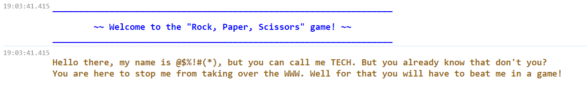
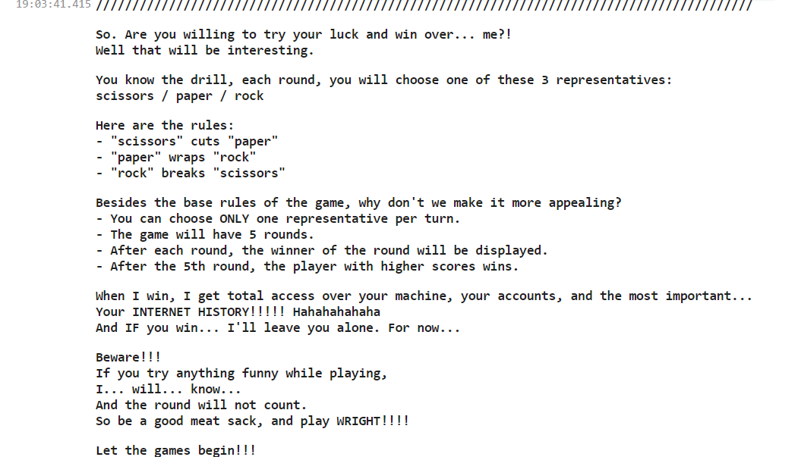
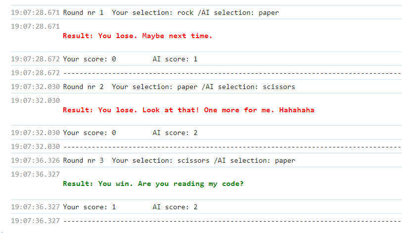
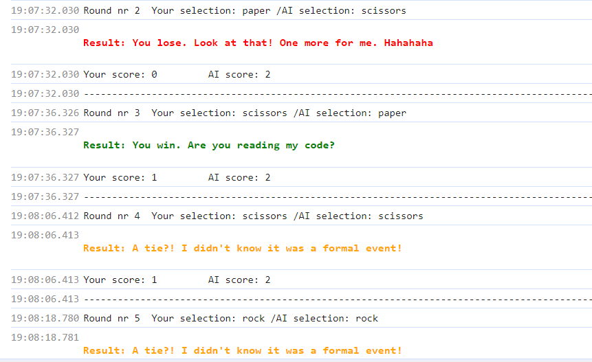
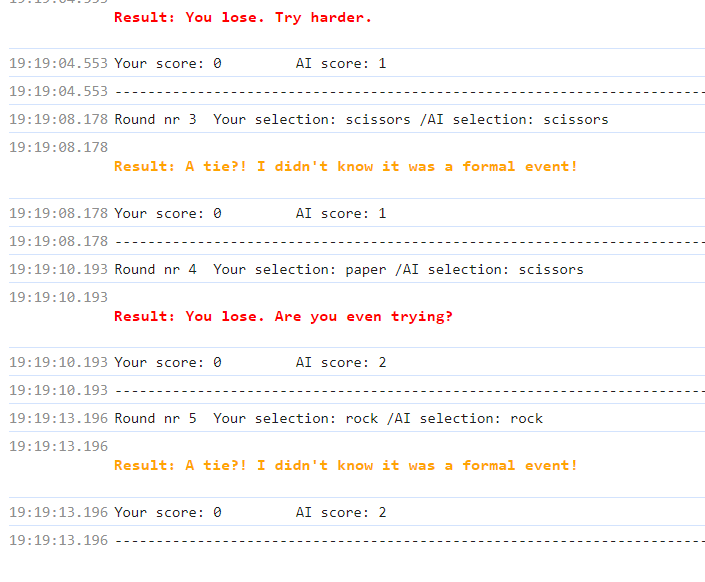

### KreativStorm-project2
## ✂️ Our Rock, Paper, Scissors Game -   


## Table of contents

  - [Overview](#overview)
  - [The Project](#the-project)
  - [Screenshots](#screenshots)
  - [Links](#links)
  - [What we used](#What-we-used)
  - [What we learned](#what-we-learned)
  - [Code snippets](#Code-snippets)
  - [Continued development](#continued-development)
  - [Useful resources](#useful-resources)


## Overview

### The Project
We created a rock, paper, scissors Js game that can be played on the console of our browser.

### Links

- Solution URL: [Github](https://github.com/elic4vet/kreativstorm-project2-game)
- Live Site URL: [Live demo](https://github.com/elic4vet/kreativstorm-project2-game)

### Screenshots












### What we used

- Different types of console methods, like: console.log() and console(clear);
- Window Object Methods: prompt(), alert(), confirm();
- Primitives and Reverence Types (strings, numbers, boolean, null, arrays, functions);
- Variables (let, const);
- Loops (for…. / do … while ….);
- Conditional Statements (if … else …);
- JS Operators ( arithmetic operators – increment; comparison operators – equality operator; ternary / conditional operator; logical operators)
- The %c format specifier to style the console messages with CSS.

### What we learned

- How to create a game using  JavaScript.
- How to style the console messages with CSS, using the %c format specifier.

### Code snippets

Some code snippets of our project:


```JS
const villainIntro = `
%cHello there, my name is @$%!#(*), but you can call me TECH. But you already know that don\'t you?
You are here to stop me from taking over the WWW. Well for that you will have to beat me in a game!

`
const gameInstruction = `%c//////////////////////////////////////////////////////////////////////////////////////////

So. Are you willing to try your luck and win over... me?!
Well that will be interesting.

You know the drill, each round, you will choose one of these 3 representatives:
scissors / paper / rock

Here are the rules:
- "scissors" cuts "paper"
- "paper" wraps "rock"
- "rock" breaks "scissors"

Besides the base rules of the game, why don't we make it more appealing?
- You can choose ONLY one representative per turn.
- The game will have 5 rounds.
- After each round, the winner of the round will be displayed.
- After the 5th round, the player with higher scores wins.

When I win, I get total access over your machine, your accounts, and the most important...
Your INTERNET HISTORY!!!!! Hahahahahaha
And IF you win... I\'ll leave you alone. For now...

Beware!!!
If you try anything funny while playing,
I... will... know...
And the round will not count.
So be a good meat sack, and play WRIGHT!!!!

Let the games begin!!!
Good luck! You will need it! Muahahahahahaha

//////////////////////////////////////////////////////////////////////////////////////////
`;
```
```JS
function game() {
  for (let i = 0; i < 5; i++) {
    const computerSelection = computerPlay();
    const playerSelection = obtainPlayerSelection();
    console.log(`Round nr ${i+1}  Your selection: ${playerSelection} / AI selection: ${computerSelection}`);
    const result = playRound(playerSelection, computerSelection);
    updateScores(result);
    console.log(`Your score: ${playerScore}         AI score: ${computerScore}`);
    console.log("------------------------------------------------------------------------------------------");
  }
  alert(`~ Thank you for the game!
  Your score: ${playerScore}         AI score: ${computerScore}`);
  setTimeout(() => {
    terminateOrContinueGame();
  },0)
}
```

### Useful resources

[Format and style messages in the Console](https://developer.chrome.com/docs/devtools/console/format-style)

### Continued development
We plan to fully develop this project using HTML and CSS to enhance the user experience and deliver efficient results.

## Authors

- Alessandro Eumar de Lacerda Júnior 👨‍💻
- Barbara Carvalho 👩‍💻
- Elisabeth Erkekoglou 👩‍💻